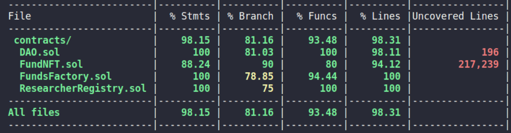

# Projet Final Alyra : DeScide

## Table of Contents

-  [Projet Final Alyra  : DeScide](#projet-final--descide)
   -  [Table of Contents](#table-of-contents)
   -  [Presentation](#presentation)
   -  [Spécification](#spécification)
   -  [Technologie](#technologie)
   -  [Installation](#installation)
   -  [Variables d'environnement](#variables-denvironnement)
   -  [Deploiement](#deploiement)
   -  [Stratégie de test](#stratégie-de-test)
   -  [Note](#note)

## Presentation

Le projet DeScide est un project de crowdfunding web3 permettant à des chercheurs de rassembler des fonds, 
et à des investisseurs de gagner des NFTs en participant à des projets qui leur tiennent à coeur.

Vidéo de présentation : https://www.youtube.com/watch?v=FFocy0PBXBk

## Spécification


L’application devra permettre à 3 acteurs les fonctionnalités suivantes :
- Le chercheur : il peut s’inscrire sur la plateforme et créer des projets de recherches. Une fois son inscription et le projet validés, un crowdfunding est ouvert. Lorsque l’objectif du fond est atteint, le chercheur peut créer des demandes de fonds, qu’il pourra obtenir si le vote des investisseurs est accordé.
- L’administrateur : il valide l’inscription des chercheurs et leur projet.
- Les investisseurs : il participent au crowdfunding et reçoivent des NFT en échange. Ils participent ensuite aux votes pour accorder des fonds au chercheur.


## Technologie

Versions des outils utilisés :

-  node : 16.16.0
-  hardhat : 2.16
-  solc : 0.7.3
-  react: 18.2.0
-  rainbowkit : 1.0
-  next: 13.4
-  wagmi 1.2
-  viem : 1.1
-  chakra-ui : 2.7

## Installation

Installation initial :

Backend, dans le repertoire backend :

```
yarn install
```

Frontend, dans le repertoire frontend :

```
yarn install
```

Lancement des tests dans le repertoire backend :

```
yarn hardhat test
```

Obtention de la couverture de tests

```
yarn hardhat coverage
```

Lancement du serveur en local, dans le repertoire frontend :

```
yarn next dev
```

## Variables d'environnement

Sur le frontend, la variable d'environnement à renseigner dans /fontend/.env. :
- NEXT_PUBLIC_CONTRACT_ADDRESS : adresse du contrat FundsFactory
- NEXT_PUBLIC_CONTRACT_RESEARCHER_ADDRESS : adresse du contract ResearcherRegistry
- NEXT_PUBLIC_NFT_STORAGE : clé api de NFT STORAGE

Sur le backend, il ya 2 variables à renseigner dans /backend/.env:

-  DEPLOYER_PRIVATE_KEY : pour la clé privée du compte qui déploie le smart contract
-  INFURA_KEY : qui est clé la Infura pour l'accès au noeud

## Deploiement

Le smart contrat ResearcherRegistry a été déployé sur Sepolia à cette adresse :

```
0xbd99E81B52C6134b6E60057d4Ec418AD73754C4B
```

Le smart contrat FundsFactory a été déployé sur Sepolia à cette adresse :

```
0x784816Ac0D73B8180fD337Ed638827DE6c86D09E
```

## Stratégie de test

Les tests couvrent 98% des instructions


Les suites de tests sont divisés en 4 groupes (describe) pour vérifier le fonctionnement de chaque étape du workflow de Vote:

-  L'enregistrement des votants (Test register voters)
-  L'enregistrement des propositions de votes (Test register a proposal)
-  L'ajout de votes (Test adding a vote)
-  Le compte des votes (Test count votes)

Un cinquième groupe permet de vérifier le fonctionnement du workflow (Test workflow)

## Note

Le déploiement du smart contract sur sepolia est lancé avec la commande :

```
cd backend
yarn hardhat run ./scripts/deploy.js --network sepolia
```

